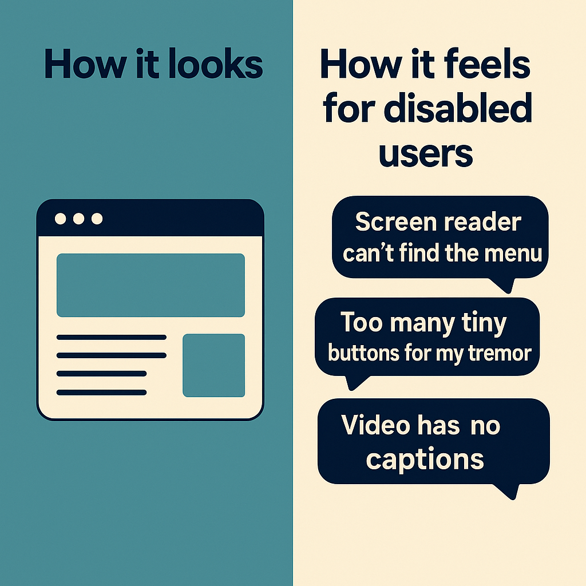

# LinkedIn Post 1: Donation Story

**Phase:** 1 – Awareness (Week 1)  
**Suggested day:** Monday  
**Image:** `LooksVsReality.png`

---

## Post Copy

We recently watched a blind user try to donate on a site that had "passed" its accessibility checks.

She found the donate button fine. But when the form loaded:
- No labels were announced
- The "amount" field read as "edit blank"
- The submit button said "button" with no context

She gave up after 4 minutes.

The Lighthouse score? 94.

Automated tools are useful – but they can't see this.

We've put some of our real findings into a short overview: [link in comments]

---

## Image

**Alt text:** Comparison showing the gap between what automated tools report and what disabled users actually experience

---

## Notes

- Link to MyAccess overview page in first comment
- This is the hook post – sets up the core problem
- Tone: factual, slightly surprising, not preachy
