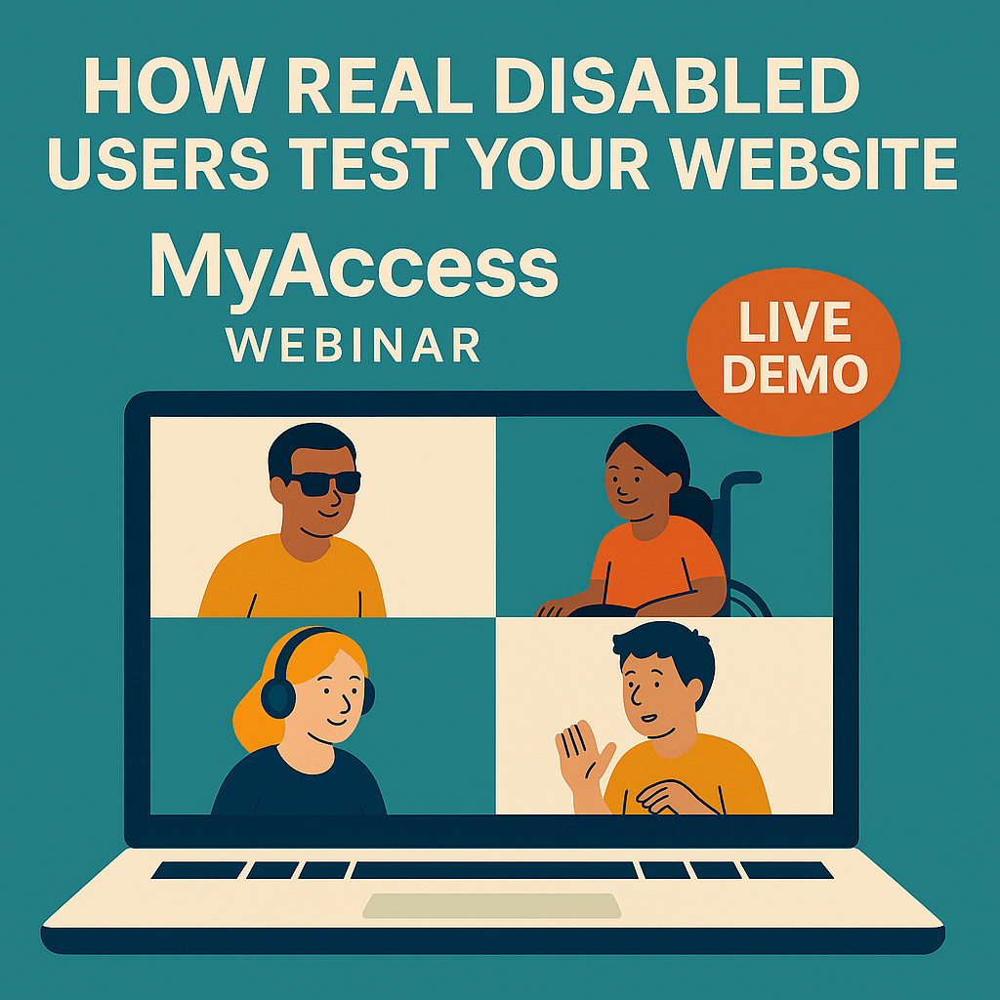

# LinkedIn Post 8: One Week Countdown

**Phase:** 2 – Webinar Promotion (Week 4)  
**Suggested day:** Friday  
**Image:** `Webinar-002.png`

---

## Post Copy

One week until our session on accessibility testing for agencies.

If you've ever wondered:
- "Is our accessibility actually good enough?"
- "How do we talk about this to clients?"
- "What would disabled users actually experience on our sites?"

This is for you.

Free, 60 minutes, practical.

[Register here]

---

## Image

**Alt text:** Webinar promotional graphic – one week countdown reminder for "Accessibility That Actually Helps Your Clients"

---

## Notes

- Question format creates self-identification
- Keep short and punchy
- Clear CTA
