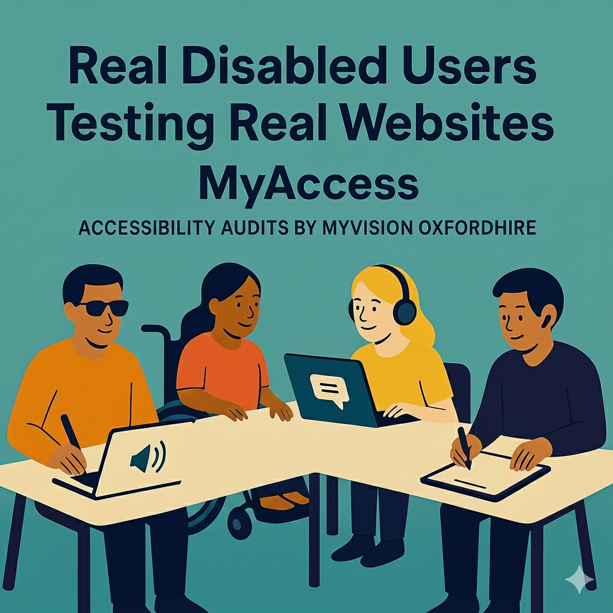
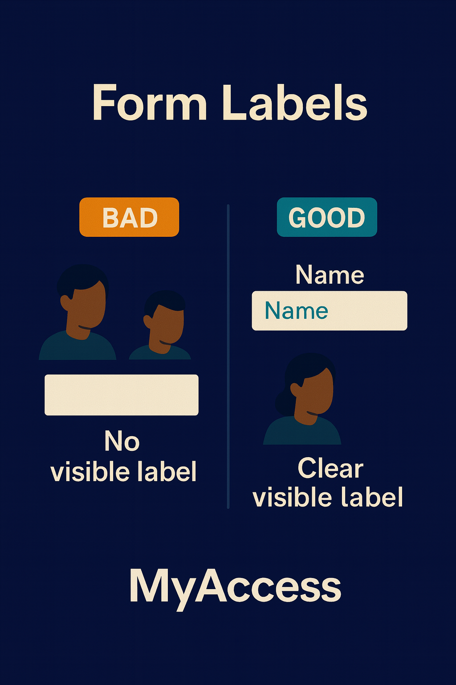
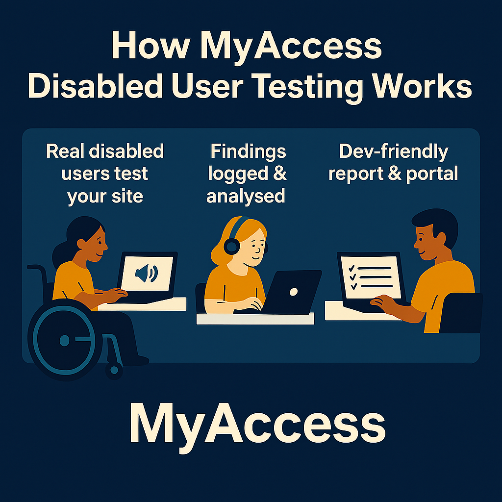

# LinkedIn Posts – MyAccess Launch Campaign (All Posts)

This document contains all 12 LinkedIn posts in publishing order. 

---

## Content Calendar Overview

| Post | Title | Phase | Week | Day | Image |
|------|-------|-------|------|-----|-------|
| 1 | Donation Story | Awareness | 1 | Mon | LooksVsReality.png |
| 2 | 3 Things Tools Miss | Awareness | 1 | Thu | VisibleFocus.png |
| 3 | Impact – Paid Testers | Awareness | 2 | Tue | MyAccess-001.png |
| 4 | Form Labels Educational | Awareness | 2 | Fri | FormLabels.png |
| 5 | Webinar Announcement | Webinar Promo | 3 | Mon | Webinar-001.png |
| 6 | Keyboard Navigation Teaser | Webinar Promo | 3 | Thu | TryTab.png |
| 7 | Why We Pay Testers | Webinar Promo | 4 | Tue | AltText-DarkBlue.png |
| 8 | One Week Countdown | Webinar Promo | 4 | Fri | Webinar-002.png |
| 9 | Day Before Reminder | Webinar Promo | 5 | Day before | Webinar_003.png |
| 10 | Post-Webinar Recap | Post-Webinar | 5 | Day after | HowItWorks.png |
| 11 | Pilot Spotlight | Conversion | 6 | Mid-week | (text only) |
| 12 | Social Proof | Conversion | 6 | End of week | (text only) |

---

# Phase 1: Awareness (Weeks 1–2)

---

## Post 1: Donation Story

**When:** Week 1, Monday  
**Image:** `LooksVsReality.png`

### Copy

We were recently working with a blind/visually impaired user who was trying to donate on a site that had "passed" its accessibility checks.

They found the donate button fine. But when the form loaded:
- No labels were announced
- The "amount" field read as "edit blank"
- The submit button said "button" with no context

She gave up after 4 minutes.

The Lighthouse score? 94.

Automated tools are useful – but they can't see these real-life details.

We've put some of our real findings into a short overview: [link in comments]

### Image

**Alt text:** Comparison showing the gap between what automated tools report and what disabled users actually experience

### Notes
- Link to MyAccess overview page in first comment
- This is the hook post – sets up the core problem

---

## Post 2: 3 Things Tools Miss

**When:** Week 1, Thursday  
**Image:** `VisibleFocus.png`

### Copy

3 things automated tools can't see that disabled users spot in 30 seconds:

1. Focus indicators that technically exist but are invisible on your colour scheme
2. Forms that "have labels" but announce nothing useful to a screen reader
3. Navigation that's "keyboard accessible" but requires 47 tabs to reach the main content

Tools check the code. Users check the experience.

(We found all three of these on a single site last month. The agency had no idea.)

We combine both at MyAccess.

### Image

**Alt text:** Example of focus indicator visibility – showing how focus states can pass automated checks but still be difficult for users to see

### Notes
- List format performs well on LinkedIn
- Each point is a real issue we've found

---

## Post 3: Impact – Paid Testers

**When:** Week 2, Tuesday  
**Image:** `MyAccess-001.png`

### Copy

When we pay disabled testers to walk through a site, we're not just finding issues.

We're creating paid work for people who are often excluded from the job market.

Every project funds our wider work supporting people living with sight loss across Oxfordshire.

That's accessibility with purpose.

### Image

**Alt text:** MyAccess branding – disabled user testing service run by MyVision Oxfordshire

### Notes
- Social impact angle; differentiates from commercial accessibility services
- Shorter post to let the message land
- No CTA needed; brand/values building

---

## Post 4: Form Labels Educational

**When:** Week 2, Friday  
**Image:** `FormLabels.png`

### Copy

"Our forms are accessible – we added labels."

We hear this a lot.

Then we watch a screen reader user try to complete the form:
- The label says "Name" but it's not programmatically linked
- The screen reader announces "edit blank"
- The user has no idea what information to enter

Labels need to be *connected*, not just present.

This is the kind of thing our disabled testers catch in minutes.

### Image

**Alt text:** Example showing the difference between visible labels and programmatically linked labels that screen readers can announce

### Notes
- Educational content
- Common misconception addressed
- Positions disabled user testing as the solution

---

# Phase 2: Webinar Promotion (Weeks 3–5)

---

## Post 5: Webinar Announcement

**When:** Week 3, Monday  
**Image:** `Webinar-001.png`

### Copy

In January, we're running a free session for agencies on what disabled users find that tools miss.

**Accessibility That Actually Helps Your Clients**
📅 Friday, 30th January
⏰ 10am – 11am
💻 Online, free

You'll see:
- How 8–10 disabled users actually test a site
- Where automated reports matched reality (and where they didn't)
- A practical model for £5–15k projects

Link to register in comments 👇

### Image

**Alt text:** Webinar promotional graphic – "Accessibility That Actually Helps Your Clients" – free online session for web agencies

### Notes
- Add in webinar date & time with confirmed details
- Put registration link in first comment (found LinkedIn algorithm prefers this)
- Create LinkedIn Event and link it

---

## Post 6: Keyboard Navigation Teaser

**When:** Week 3, Thursday  
**Image:** `TryTab.png`

### Copy

Here's something we found last month:

A navigation menu that looked fine. Worked fine with a mouse.

But when a keyboard user pressed Tab?
- Focus jumped past the menu entirely
- The only way to reach it was to Tab through 60+ elements
- Most users gave up

The automated scan? "All interactive elements are keyboard accessible." ✅

We'll be walking through examples like this in our January webinar.

[Registration link in comments]

### Image

**Alt text:** Illustration showing keyboard navigation testing – pressing Tab to move through interactive elements

### Notes
- Real example of accessibility issue to get people curious about DUT for Webinar 
- Bridges to webinar registration
- Shows the gap between automated passes and real-world failings 

---

## Post 7: Why We Pay Testers

**When:** Week 4, Tuesday  
**Image:** `AltText-DarkBlue.png`

### Copy

A question we sometimes get:

"Do your testers volunteer?"

No. We pay every disabled tester for their time.

Why?
- Their expertise has value
- Testing is real work
- Too many "accessibility" initiatives rely on unpaid labour from disabled people

Every MyAccess project creates paid work and funds our wider services.

We'll talk more about this in our January webinar → [link]

### Image

**Alt text:** Example of meaningful alt text – showing how images should be described for screen reader users

### Notes
- Differentiates from other services and shows the project as values-based 
- Addresses a genuine question people have
- Soft webinar CTA at the end

---

## Post 8: One Week Countdown

**When:** Week 4, Friday  
**Image:** `Webinar-002.png`

### Copy

One week until our session on accessibility testing for agencies.

If you've ever wondered:
- "Is our accessibility actually good enough?"
- "How do we talk about this to clients?"
- "What would disabled users actually experience on our sites?"

This is for you.

Free, 60 minutes, practical.

[Register here]

### Image

**Alt text:** Webinar promotional graphic – one week countdown reminder for "Accessibility That Actually Helps Your Clients"

### Notes
- Question format creates self-identification
- Keep short and punchy
- Clear CTA

---

## Post 9: Day Before Reminder

**When:** Week 5, Day before webinar  
**Image:** `Webinar_003.png`

### Copy

Tomorrow at 10am:

**Accessibility That Actually Helps Your Clients**

We'll show what happens when real disabled users test websites that "passed" automated checks.

Spoiler: it's often not what you'd expect.

Last chance to register (or sign up for the recording): [link]

### Image

**Alt text:** Webinar promotional graphic – final reminder for tomorrow's session on disabled user testing for agencies

### Notes
- Replace {{webinar_time}} with actual time
- Urgency without being overly pushy
- Offers recording option for those who can't make it live

---

# Phase 3: Post-Webinar & Conversion (Weeks 5–6)

---

## Post 10: Post-Webinar Recap

**When:** Week 5, Day after webinar  
**Image:** `HowItWorks.png`

### Copy

3 things agencies took away from our disabled user testing webinar:

1. **Tools check code. People check experience.** Scans catch a lot, but they miss the context and confusion that real users hit every day.

2. **Real users = real credibility.** "We paid disabled people to test your site" is a much better story than a Lighthouse score.

3. **You don't need an in-house team.** A service you can plug into your workflow is enough.

Missed it? Watch the recording: [link]

### Image

**Alt text:** Diagram showing how MyAccess works – from scoping through testing to report delivery and debrief

### Notes
- Summarises key takeaways for those who missed it
- Each point reinforces core messaging
- Clear CTA to watch recording

---

## Post 11: Pilot Spotlight

**When:** Week 6, Mid-week  
**Image:** None (text-only post)

### Copy

We're working with a small group of agencies to run one-site pilots.

What's included:
✅ Scoping call to pick 1–2 key journeys
✅ 8–10 disabled testers using real assistive tech
✅ Combined automated + manual findings
✅ Agency portal access with stakeholder and developer views
✅ Prioritised remediation plan
✅ Live debrief with your team

If you've been thinking "we should do something about accessibility" – this is a low-risk way to start.

### Notes
- Direct offer post
- Checklist format is scannable
- No image – text-only format can perform well for offer/CTA posts
- Decide best way to add about how to get in contact

---

## Post 12: Social Proof

**When:** Week 6, End of week  
**Image:** None (text-only post)

### Copy

After one pilot, an agency told us:

"We used the report in our next tender. The client specifically mentioned it as a differentiator."

That's the goal: making accessibility something you can *show*, not just claim.

If you'd like to try this on one client site, we're running limited pilots now.

Details: [link] 

### Notes
- Add way to get in contact about the service

---

# Reference List for Image Files

| Post | Image Filename | Location |
|------|---------------|----------|
| 1 | LooksVsReality.png | `CampaignAssets/Images/` |
| 2 | VisibleFocus.png | `CampaignAssets/Images/` |
| 3 | MyAccess-001.png | `CampaignAssets/Images/` |
| 4 | FormLabels.png | `CampaignAssets/Images/` |
| 5 | Webinar-001.png | `CampaignAssets/Images/` |
| 6 | TryTab.png | `CampaignAssets/Images/` |
| 7 | AltText-DarkBlue.png | `CampaignAssets/Images/` |
| 8 | Webinar-002.png | `CampaignAssets/Images/` |
| 9 | Webinar_003.png | `CampaignAssets/Images/` |
| 10 | HowItWorks.png | `CampaignAssets/Images/` |
| 11 | (none) | – |
| 12 | (none) | – |

---

