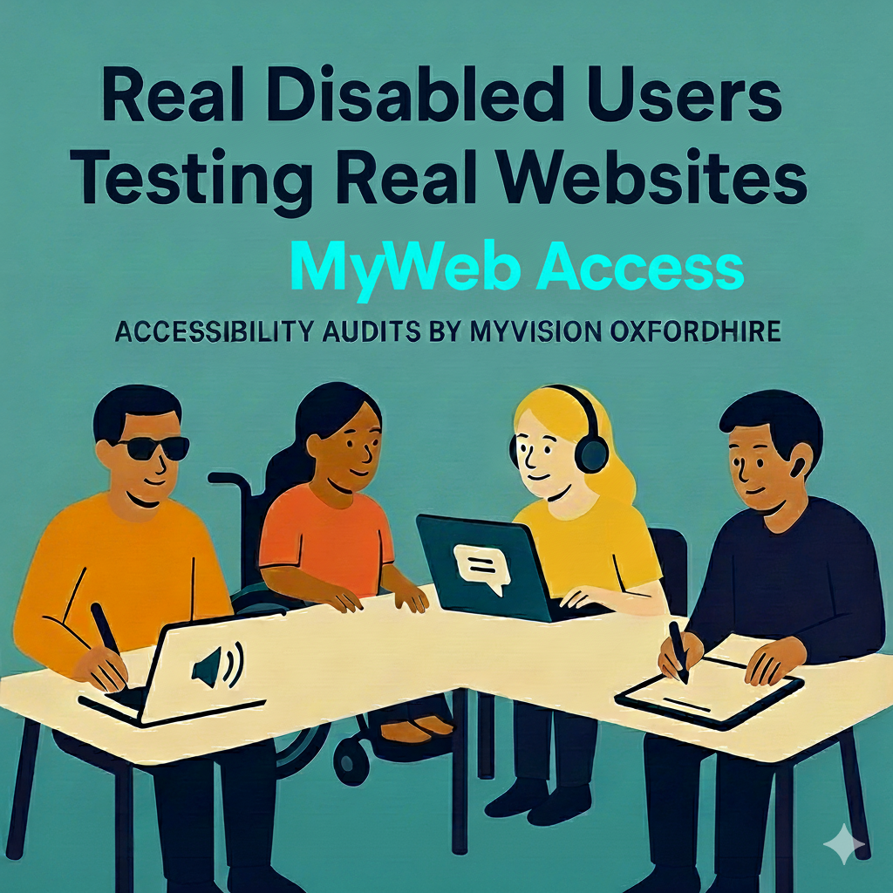
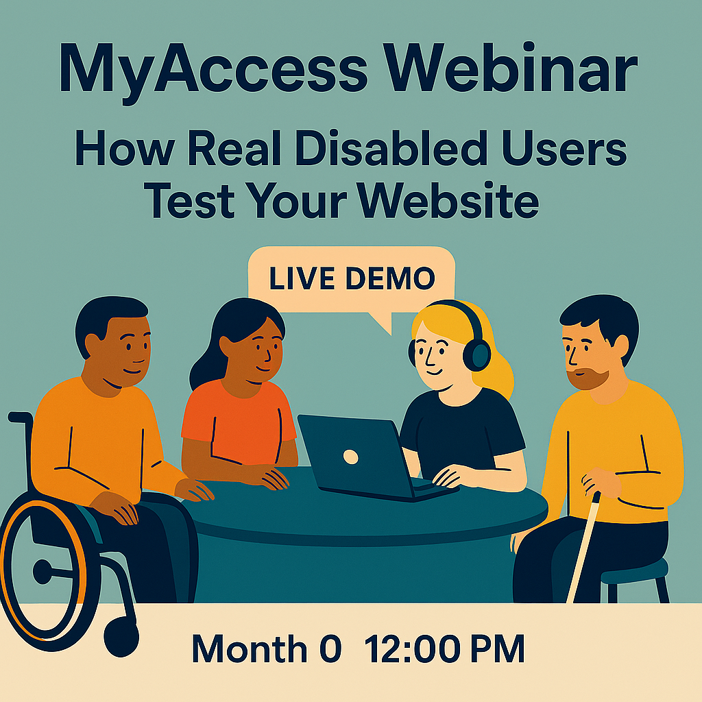
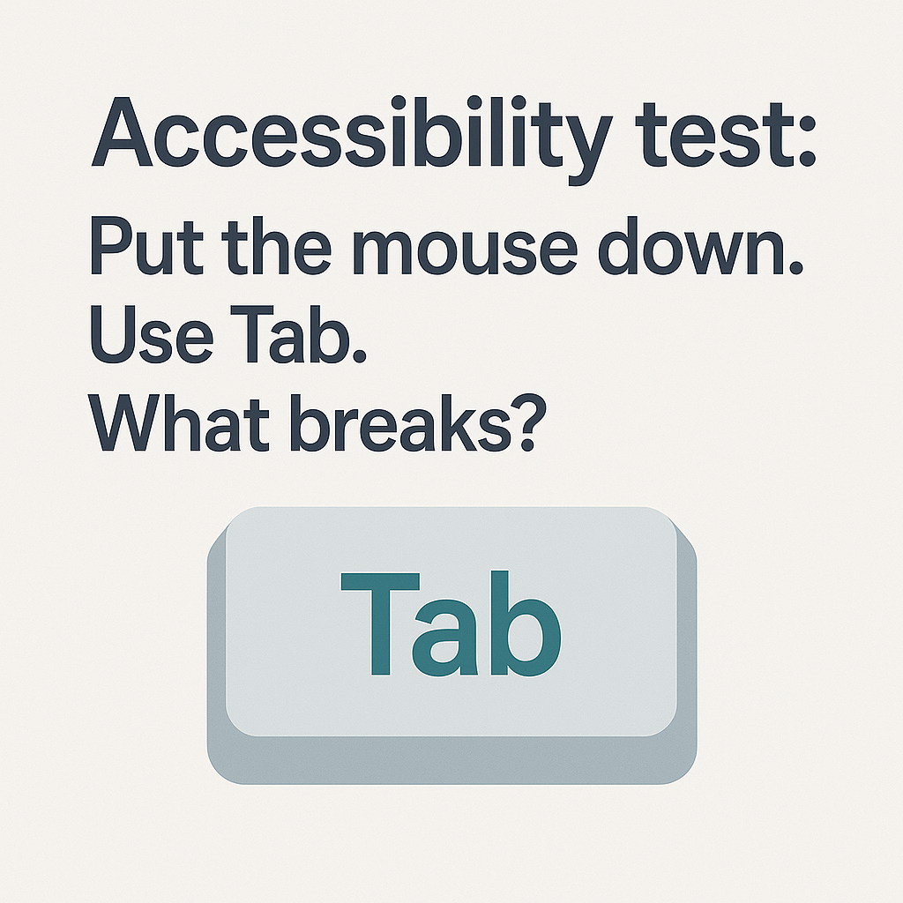
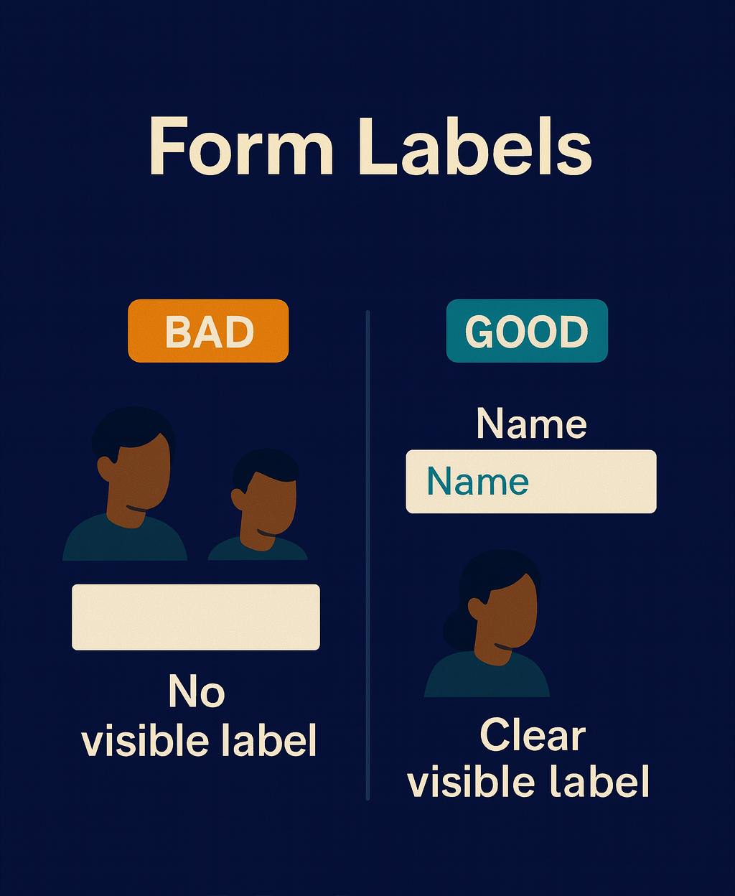

# Email Sequence – MyWeb Access Launch Campaign

This document contains all emails in sending order.

---

## Content Calendar Overview

| Email | Subject | Phase | When |
|-------|---------|-------|------|
| 1 | She gave up after 4 minutes | Awareness | Dec 1-15 |
| 2 | 3 things tools can't see | Awareness | Dec 1-15 |
| 3 | The people behind the testing | Awareness | Dec 1-15 |
| 4 | What disabled users find that tools miss | Webinar Promo | Dec 18 – mid-Jan |
| 5 | Quick reminder – January session | Webinar Promo | Early Jan |
| 6 | One week to go | Webinar Promo | 1 week before |
| 7 | Tomorrow at 10am | Webinar Promo | Day before |
| 8 | The pilot we mentioned | Conversion | Day after webinar |
| 9 | Quick follow-up on the pilot | Conversion | Few days later |
| 10 | How one agency used this in a tender | Conversion | 10-14 days after |
| Monthly | One thing from this month | Ongoing | Monthly |

---

# Phase 1: Awareness (Dec 1-15)

---

## Email 1: Awareness Intro

**Subject:** She gave up after 4 minutes  
**Preheader:** The Lighthouse score was 94.

**Alternative subject lines to test:**
- "The donation form that scored 94 but didn't work"
- "94 on Lighthouse. She still couldn't donate."

---

Hi {{first_name}},

We were recently working with a screen reader user who was trying to donate on a site that had "passed" its accessibility checks.

She found the donate button fine. But when the form loaded:
- No labels were announced
- The "amount" field read as "edit blank"
- The submit button just said "button" with no context

She gave up after 4 minutes.

The Lighthouse score? 94.

I'm Mark, from MyVision Oxfordshire. We've started running accessibility testing with real disabled users – screen reader users, keyboard-only users, people with motor impairments, people with cognitive differences.

Automated tools are useful – but they can't see these real-life details.

We've put some of our findings into a short overview if you're curious:

👉 **[Have a look]({{myaccess_overview_link}})**

Mark

MyVision Oxfordshire  
Registered Charity No. 1140556

---

## Email 2: Automation vs Users

**Subject:** 3 things tools can't see  
**Preheader:** That disabled users spot in 30 seconds.

---

Hi {{first_name}},

3 things automated tools can't see that disabled users spot in 30 seconds:

1. Focus indicators that technically exist but are invisible on your colour scheme
2. Forms that "have labels" but announce nothing useful to a screen reader
3. Navigation that's "keyboard accessible" but requires 47 tabs to reach the main content

We found all three of these on a single site last month. The agency had no idea.

One of our testers, after trying to complete a contact form:

> "I couldn't tell which fields were which. I had no idea if I was typing my name or email address. I eventually gave up."

The automated scan said all fields had labels. They did – they just weren't connected to anything.

Tools check the code. Users check the experience.

If you want to see what a report looks like when you combine both:

👉 **[View an example]({{sample_report_link}})**

Mark

---

## Email 3: Meet the Testers + Tease Webinar

**Subject:** The people behind the testing  
**Preheader:** Real disabled users, paid for their time.

---

Hi {{first_name}},

I've been talking about what we find. I wanted to say a bit about who finds it.

When we test a site, we work with real disabled people who use assistive technology every day:

- Screen reader users (JAWS, NVDA, VoiceOver)
- Keyboard-only users (including people with motor impairments)
- People who rely on magnification or high contrast
- People with cognitive differences (dyslexia, ADHD, autism)

For each project, 8-10 of them try to complete the journeys we've agreed. Donation forms. Checkout flows. Booking systems. Contact pages.

They're not hunting for edge cases. They're just trying to do normal things.

One tester told us recently:

> "I've been using the internet for 20 years. I know when a site doesn't want me there."

Another, after trying to navigate a higher education website:

> "I rely on keyboard navigation due to my motor disability. I couldn't see which element had focus. I was essentially navigating blind, counting tab presses and guessing where I was on the page."

We pay every tester for their time. And every project helps fund MyVision's wider work.

---

We're running a session in January where we'll walk through some real examples – what the automated scan said vs what users actually experienced.

👉 **[Register your interest]({{webinar_early_interest_link}})**

Mark

---

# Phase 2: Webinar Promotion (Dec 18 – mid-Jan)

---

## Email 4: Main Webinar Invite

**Subject:** What disabled users find that tools miss  
**Preheader:** Free session for agencies, January

---

Hi {{first_name}},

Remember the donation form with the 94 Lighthouse score that a screen reader user couldn't complete?

We're running a free session in January where we'll show exactly what happened – the automated report vs the real user experience, side by side.

**Accessibility That Actually Helps Your Clients**

📅 Friday, 30th January  
⏰ 10am – 11am  
💻 Online, free

You'll see:
- Real examples of where automated tools said "pass" but users got stuck
- How we run tests with 8-10 disabled users
- A practical model for adding this to £5-15k projects

👉 **[Save your spot]({{webinar_link}})**

Can't make the time? Register anyway and we'll send the recording.

Mark

---

## Email 5: Post-Holiday Reminder

**Subject:** Quick reminder – January session  
**Preheader:** What 8 disabled users found on a "fully accessible" site

---

Hi {{first_name}},

Happy new year.

Quick reminder about our session later this month on accessibility testing.

We've been testing sites with real disabled users – screen reader users, keyboard-only users, people with motor impairments, people with cognitive differences – and comparing what they find to what the automated tools report.

The gaps are often surprising.

**Accessibility That Actually Helps Your Clients**

📅 Friday, 30th January  
⏰ 10am – 11am  
💻 Free, online

👉 **[Register here]({{webinar_link}})**

If you can't make it live, register anyway for the recording.

Mark

---

## Email 6: What You'll Get

**Subject:** One week to go  
**Preheader:** What you'll get from the session

---

Hi {{first_name}},

One week until our session on accessibility testing.

If you've ever wondered:
- "Is our accessibility actually good enough?"
- "How do we talk about this to clients?"
- "What would disabled users actually experience on our sites?"

This is for you.

We'll walk through real examples – including that donation form where every field read as "edit blank" to a screen reader, despite a Lighthouse score of 94.

📅 Friday, 30th January  
⏰ 10am – 11am  
💻 Free, online

👉 **[Register]({{webinar_link}})**

Mark

---

## Email 7: Last Chance

**Subject:** Tomorrow at 10am  
**Preheader:** Last chance to register (or get the recording)

---

Hi {{first_name}},

Quick one – our accessibility session is tomorrow.

**Friday, 30th January at 10am**

We'll show what happens when real disabled users test sites that "passed" automated checks.

Spoiler: it's often not what you'd expect.

👉 **[Register here]({{webinar_link}})**

Can't join live? Register anyway and we'll send you the recording.

Mark

---

# Phase 3: Conversion (After Webinar)

---

## Email 8: Post-Webinar Pilot Offer

**Subject:** The pilot we mentioned  
**Preheader:** Try this on one site

---

Hi {{first_name}},

Thanks for joining the session – whether you caught it live or you're watching the recording.

As promised, here's what the pilot includes:

**For one site (yours or a client's):**

✅ Scoping call to pick 1-2 key journeys  
✅ 8-10 disabled testers using real assistive tech  
✅ Combined automated + manual findings  
✅ Agency portal access with stakeholder and developer views  
✅ Prioritised remediation plan  
✅ Live debrief with your team

Every tester is paid. Every project funds our wider charity work.

If you want to talk through whether this fits a current project:

👉 **[Book a 15-minute call]({{booking_link}})**

Or just reply with a couple of times that work for you.

Mark

---

## Email 9: Pilot Final Call

**Subject:** Quick follow-up on the pilot  
**Preheader:** A few spots left

---

Hi {{first_name}},

Quick follow-up – I know how fast things move once the year gets going.

We're keeping the pilot small so we can give each agency proper attention. We've got space for a few more.

You'd get:
- Real feedback from 8-10 disabled users
- A clear list of what to fix first
- A social impact story you can use in future proposals

Even if you decide it's not for you afterwards, you'll have made one site genuinely more accessible.

👉 **[Book a 15-minute call]({{booking_link}})**

Or reply with "not now, keep me posted" and I'll check back in a few months.

Mark

---

## Email 10: Case Study Follow-up

**Send:** 10-14 days after webinar

**Subject:** How one agency used this in a tender  
**Preheader:** A quick story from a recent pilot

---

Hi {{first_name}},

Quick story from an agency we worked with recently.

They were pitching for a community organisation's website rebuild. The brief mentioned accessibility but didn't require anything specific.

They included our disabled user testing as part of their proposal – scoped as a line item, run after the build phase.

The client told them afterwards it was one of the reasons they won. Not just because it was "good practice" but because no other agency had offered anything like it.

The actual quote: "We've never had anyone offer to pay real disabled users to test our site."

---

What made the difference wasn't just the testing. It was what we found.

Their forms had a 0% completion rate for screen reader users. Every field announced as "edit blank" – no indication of what information to enter. One of our testers said:

> "I couldn't tell which fields were which. I eventually gave up trying to reach them online."

The automated scan? All green. "All fields have labels."

When the agency showed the client the gap between the scan and the real user experience, they got it immediately. And they had something concrete to put in future tenders.

---

If you're working on any proposals where accessibility might come up – councils, universities, charities, NHS trusts – this could be worth a conversation.

👉 **[15-minute call to see if there's a fit]({{booking_link}})**

No pitch. Just a look at whether this makes sense for a current project.

Mark

---

# Phase 4: Ongoing

---

## Monthly Nurture Template

**Send:** Mid-month, ongoing  
**Purpose:** Stay on radar for non-converters without hard selling

**Subject:** One thing from this month  
**Preheader:** A quick accessibility find

---

Hi {{first_name}},

Quick one – we tested a checkout flow last week where the "Pay Now" button just announced "button" to screen reader users. No context, no amount, nothing.

The user had no idea what they were about to do.

The automated scan said it was fine.

That's it. Just wanted to share.

If you ever want to chat about adding this kind of testing to a project, I'm around.

Mark

---

### Notes for future sends

Rotate the example each month. Keep it short – one real issue, no hard sell.

**Example bank:**
- Checkout button that just said "button" (no context)
- Navigation menu that required 60+ tabs to reach
- Form labels present in HTML but not connected to fields
- Focus indicators that passed checks but were invisible on the colour scheme
- Error messages that appeared visually but weren't announced to screen readers
- Skip link that was present but didn't do anything
- Dropdown menu where screen reader couldn't tell if it was open or closed

**Format:**
- 3-4 sentences describing the issue
- What the automated scan said
- One line: "If you ever want to chat..."
- No CTA link unless they ask

**Cadence:** Monthly, sent mid-month to avoid start-of-month inbox competition.

---

# Reference: Image Files

| Email | Image | Purpose |
|-------|-------|---------|
| 1 | LooksVsReality.png | Sets up the core problem |
| 2 | VisibleFocus.png | Matches focus indicators content |
| 3 | MyAccess-001.png | Brand/testers intro |
| 4 | Webinar-001.png | Main webinar invite |
| 5 | Webinar-002.png | Post-holiday reminder |
| 6 | Webinar_003.png | One week countdown |
| 7 | TryTab.png | Last chance, keyboard theme |
| 8 | HowItWorks.png | Post-webinar process |
| 9 | (none) | Short nudge email |
| 10 | FormLabels.png | Case study about form labels |
| Monthly | (none) | Text-only nurture |

