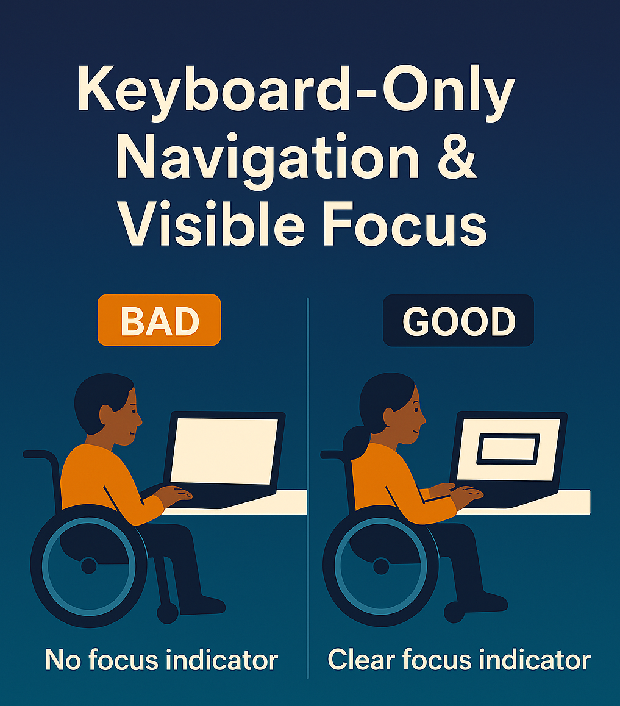

Subject: 3 things tools can't see
Preheader: That disabled users spot in 30 seconds.

---

## Suggested Image

**Image:** `VisibleFocus.png` – Matches focus indicators content in the email

---

Hi {{first_name}},

3 things automated tools can't see that disabled users spot in 30 seconds:

1. Focus indicators that technically exist but are invisible on your colour scheme
2. Forms that "have labels" but announce nothing useful to a screen reader
3. Navigation that's "keyboard accessible" but requires 47 tabs to reach the main content

We found all three of these on a single site last month. The agency had no idea.

One of our testers, after trying to complete a contact form:

> "I couldn't tell which fields were which. I had no idea if I was typing my name or email address. I eventually gave up."

The automated scan said all fields had labels. They did – they just weren't connected to anything.

Tools check the code. Users check the experience.

If you want to see what a report looks like when you combine both:

👉 **[View an example]({{sample_report_link}})**

Mark
