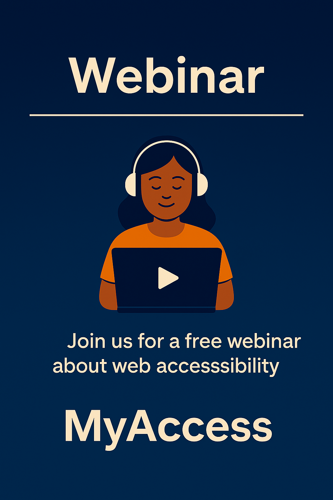

Subject: One week to go
Preheader: What you'll get from the session

---

## Suggested Image

**Image:** `Webinar_003.png` – One week countdown graphic

---

Hi {{first_name}},

One week until our session on accessibility testing.

If you've ever wondered:
- "Is our accessibility actually good enough?"
- "How do we talk about this to clients?"
- "What would disabled users actually experience on our sites?"

This is for you.

We'll walk through real examples – including that donation form where every field read as "edit blank" to a screen reader, despite a Lighthouse score of 94.

📅 Friday, 30th January
⏰ 10am – 11am
💻 Free, online

👉 **[Register]({{webinar_link}})**

Mark
